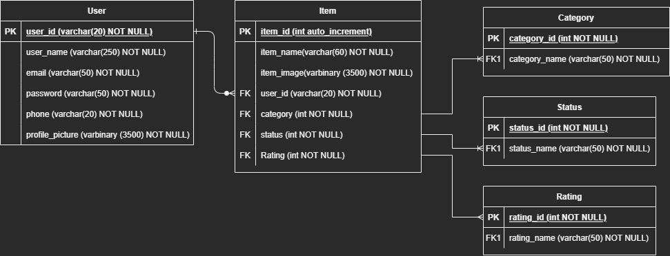

# Business Logic

## Entities:
- Items
- Categories (CAT)
- User
- Status (CAT)

## Attributes:
- Items:
    - item_id (PK)
    - Item name
    - Image
    - Category (CAT)
    - Status (CAT)

- User
    - User_id (PK)
    - User Name (UQ)
    - User email (UQ)
    - Profile picture
    - Password
    - Phone number (UQ)

- Categories (CAT):
    - Categories_id (PK)
    - Videogames
    - Books
    - Movies

- Status (CAT)
    - Status_id (PK)
    - Finished
    - On going
    - On waiting

- Rating (CAT):
    - Rating_id (PK)
    - Great
    - Good
    - Ok
    - Never again

## Relationships:
- The **user** adds **items** (1 - M)
- The **user** stablish a **category** (1 - 1)
- The **items** have **categories** (1 - 1)
- The **user** stablish a **status** (1 - 1)
- The **items** have a **status** (1 - 1)

---
# Entity Relationship Diagram

---
# Business Rules
- User:
    - Create user
    - Read user data
    - Update user data
    - Update user password
    - Update user email
    - Update profile picture
    - Delete user

- Item:
    - Create item
    - Read item info
    - Read number of items
    - Update item info
    - Delete item

- Category:
    - Create a category
    - Read all the categories
    - Read a category
    - Update a category
    - Delete a category

- Status:
    - Create a status
    - Read all the status
    - Read a status
    - Update a status
    - Delete a status

- Rating:
    - Create a rating
    - Read all the ratings
    - Read a rating
    - Update a rating
    - Delete a rating
    

## [Corrida de datos](Corrida_Datos.xlsx)

# [🔙](../README.md)